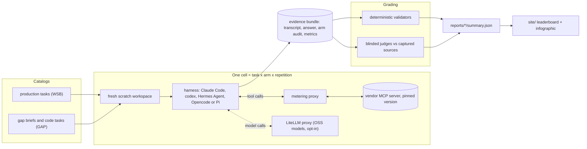
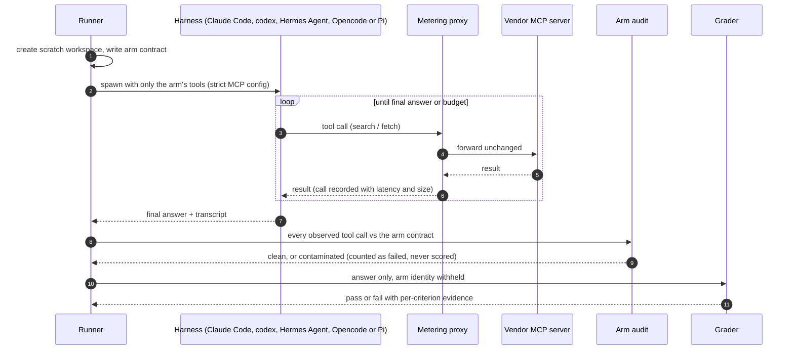
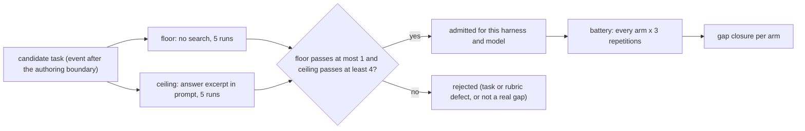
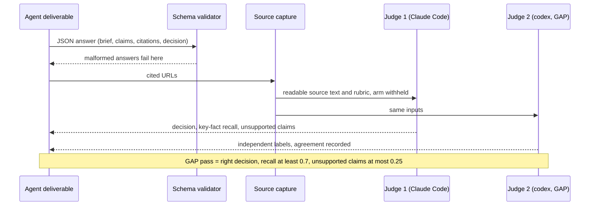
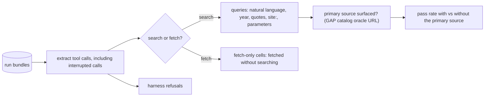
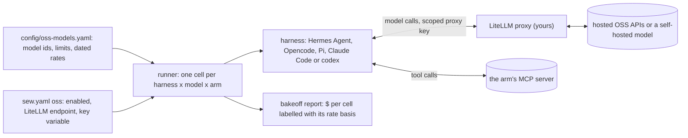
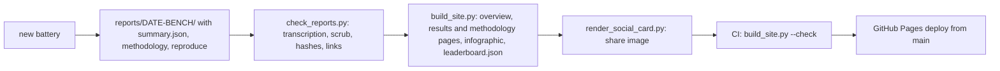
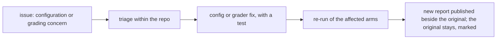

# Searchlight

**Website: [searchlightai.dev](https://searchlightai.dev)**

**An open benchmark of what web search does for coding agents.** Searchlight runs real
agent harnesses against task catalogs: Claude Code and codex, and, with
[OSS models](#oss-models) behind a LiteLLM proxy, Hermes Agent, Opencode and Pi. The
published results so far cover Claude Code and codex. Each run gives the agent
exactly one retrieval arm: one vendor's search server, the harness's own built-in search,
or no search at all. Searchlight then grades the finished job, not the search results. It also
records every tool call, so you can see *how* the agent used the tool it was given.


- **Website:** [searchlightai.dev](https://searchlightai.dev): an overview, then
  [results](https://searchlightai.dev/results.html) (leaderboards and full run reports) and
  [methodology](https://searchlightai.dev/methodology.html). Generated into [`site/`](site/) and
  published from `main` on every report change.
- **Machine-readable leaderboard:** [`site/leaderboard.json`](site/leaderboard.json).
- **Recorded reports:** [`reports/`](reports/README.md).

> **Before comparing vendors:**
> - Each arm ran 18 to 42 cells, and the 95% intervals overlap almost everywhere.
> - In the agent benchmarks, every vendor was tested through its own MCP server at a pinned version with default
>   settings. The separate [search API head-to-head](reports/2026-09-26-search-api-head-to-head/REPORT.md) called
>   four vendors' APIs directly with tuned parameters, ran each question once, and was run for a knowledge base about
>   Exa, one of the four.
> - Rankings changed between the two agents.
>
> Read [Fairness and known limitations](#fairness-and-known-limitations) before quoting a position.

---

## What Searchlight measures

| Benchmark | Question it answers | Unit of work | Graded on |
|---|---|---|---|
| **WSB** (web search bakeoff) | Does an arm help an agent answer research questions correctly? | 18 production tasks, 3 repetitions | deterministic validators or a blinded rubric judge |
| **GAP** (search gap bench) | Does search change the outcome of a job whose answer post-dates the model? | calibrated briefs (and code tasks) | the finished deliverable, judged against captured primary sources |
| **DSB** (domain strength bench) | Which retrieval surface is strong in which domain? | recorded domain observations | per-domain scorecards |
| **Behavior analysis** | How did the agent actually use its tool? | every logged tool call | query style, search versus fetch, primary-source retrieval |

```
                       ┌──────────────────────────────────────────────────────────┐
                       │             the same agent, the same prompt              │
                       │      Claude Code (claude-opus-5-5)  or  codex (gpt-6.1)  │
                       │  or Hermes Agent, Opencode, Pi on an OSS model (LiteLLM) │
                       └───────────────────────────┬──────────────────────────────┘
                                                   │ exactly one retrieval arm
   ┌──────────┬──────────┬──────────┬──────────┬───┴──────┬──────────┬──────────┬──────────┐
   │no-search │  native  │  Brave   │  Tavily  │   Exa    │ Parallel │Firecrawl │Perplexity│
   │ (memory) │ harness  │   MCP    │   MCP    │   MCP    │   MCP    │   MCP    │   MCP    │
   │          │ built-in │  server  │  server  │  server  │  hosted  │  server  │  server  │
   └──────────┴──────────┴──────────┴──────────┴──────────┴──────────┴──────────┴──────────┘
   GAP adds two reference arms per task:  floor = no search    ceiling = answer excerpt in prompt
```

## How a run works

Harness metadata lives in [`sew.harnesses`](lib/python/sew/harnesses/registry.py).
Each `HarnessSpec` defines the harness's binary, protocol, arm spawn writer and
capabilities. To add a harness, define its spec in a harness module and register
it in [`sew.harnesses.__init__`](lib/python/sew/harnesses/__init__.py). Schema
validation, live CLI choices, binary checks and spawn dispatch read live registry
views, so registrations made after import are visible to those consumers.
Protocol, spawn writer and usage parser references can use `module:attribute`
strings, resolved lazily to avoid import cycles. Judges remain explicitly pinned
to the hosted harnesses they support.



### Anatomy of one cell



### What each arm can touch

Arms differ only in their retrieval surface. Everything else (model, prompt, budgets,
workspace) is identical.

```
 Claude Code                                         codex
 ───────────                                         ─────
 claude --print --output-format stream-json          codex exec --json --ephemeral
   --mcp-config <cell>/claude-mcp.json                 --sandbox read-only
   --strict-mcp-config        ← only this arm's server --disable shell_tool --disable unified_exec
   --tools <arm built-ins>    ← restricts built-ins    --disable browser_use --disable computer_use
   --allowedTools <same set>  ← pre-approves them      --disable apps --disable plugins ...
                                                       (+ --search on the native arm only)
 ┌──────────────┬──────────────────────────────┐    ┌──────────────┬───────────────────────────┐
 │ provider arm │ ToolSearch, Read             │    │ provider arm │ one MCP server            │
 │              │ + mcp__<vendor>__*           │    │              │                           │
 │ native arm   │ WebSearch, WebFetch, Read    │    │ native arm   │ built-in search and       │
 │              │                              │    │              │ page views                │
 │ no-search,   │ nothing                      │    │ no-search,   │ nothing                   │
 │ floor,       │                              │    │ floor,       │                           │
 │ ceiling      │                              │    │ ceiling      │                           │
 └──────────────┴──────────────────────────────┘    └──────────────┴───────────────────────────┘
 Read is local: Claude Code saves oversized tool results to a file the model must Read.
```

The OSS harnesses get the same contract, built from their own configuration in a fresh
per-cell home. Each runs only an explicit `litellm/<route>` model; see [OSS models](#oss-models).

| Harness | Provider arm | Native arm | no-search, floor, ceiling |
|---|---|---|---|
| Hermes Agent | one `mcp-<server>` toolset; built-in web, shell and other toolsets disabled | not applicable (no isolated native search) | nothing |
| Opencode | one local MCP server; built-in web, shell, filesystem and delegation tools denied | client-side `websearch` and `webfetch`; shell denied | nothing |
| Pi | one MCP server through Searchlight's stdio bridge; built-in tools, extensions and skills off | not applicable (Pi has no web tools) | nothing |

A not-applicable cell is recorded as such without launching the harness.

After every cell an **arm audit** compares each observed tool call with the arm contract.
A call outside the contract (for example, a provider arm reaching native search) marks the
cell contaminated. A contaminated cell counts as a failure and is never scored as a pass.

### Code tasks run inside an egress sandbox

GAP code tasks give the agent a real repository, a shell and an offline wheel cache. The
agent must not download the fixed package version, or read it from the verifier's copy.

```
┌──────────────────────────────────────────────────────────────────────────────┐
│ host                                                                         │
│  ┌─────────────────────────────────────────────────────────────────────────┐ │
│  │ egress sandbox: Seatbelt (macOS) or bubblewrap (Linux)                  │ │
│  │   network: deny all  ·  canary probes must be refused before the cell   │ │
│  │  ┌───────────────────────────────────────────────────────────────────┐  │ │
│  │  │ agent workspace: repo + old/dependency wheels only (no fixed one) │  │ │
│  │  │   pip forced offline; package commands audited                    │  │ │
│  │  └───────────────────────────────────────────────────────────────────┘  │ │
│  │   verifier cache (old + new wheels): read-denied to the agent           │ │
│  └─────────────────────────────────────────────────────────────────────────┘ │
│  search arm traffic leaves only through the arm's MCP server                 │
└──────────────────────────────────────────────────────────────────────────────┘
```

Cells whose isolation cannot be established are refused, not run. See
[RUNBOOK-gap.md](RUNBOOK-gap.md) for the full isolation contract.

## GAP: calibration and gap closure

A GAP task counts only if it is out of the model's reach without search, and within reach
when the answer is handed over. Calibration is repeated for each harness and model.



```
gap closure  =  (arm pass rate − floor pass rate) / (ceiling pass rate − floor pass rate)

   floor                         arm                              ceiling
   0%  ●────────────────────────────●──────────────────────────────●  95%
       └─────────── closed ─────────┘└────────── remaining ────────┘
   1.00 = the arm did as well as handing the agent the answer. It can exceed 1.
```

## Grading



- **WSB** uses deterministic validators where a task has one. Otherwise a single blinded
  Claude Code judge scores the task rubric.
- **Statistics:**
  - Pass rates carry Wilson 95% intervals.
  - GAP compares each arm with the floor by an exact McNemar test (paired by task and repetition).
  - GAP gap-closure intervals use a seeded paired task bootstrap.
- **GAP tokens per success** counts every agent token in an arm, failed cells included, divided by
  the number of passing cells. **WSB tokens per success** uses measured tokens from graded cells
  divided by measured successes; ungraded and unmeasured cells are excluded, and per-arm
  coverage counts were not retained.

## Measuring how agents search

`scripts/analyze_search_behavior.py` reads stored transcripts. It makes no network or model calls.
It reads each harness's own event stream: Claude Code and codex, Opencode `tool_use` events,
Hermes Agent tool calls and Pi tool results. Harnesses prefix a vendor's tool with its server
name in different ways (`mcp__exa__web_search_exa`, `mcp_exa_web_search_exa`,
`exa_web_search_exa`); the analyzer drops the prefix, so every harness's call counts as
the vendor's `web_search_exa`. Opencode's native `websearch` and `webfetch` count as search and fetch.
Failed Pi calls and calls interrupted before their results arrive still count as calls
and contribute their queries. They provide no returned evidence: source coverage stays
unknown unless another observed result contains the oracle URL.



The rules are deliberately simple and are printed in the
[methodology](reports/2026-10-05-agent-search-behavior/methodology.md). Because the
natural-language rule can miss descriptive phrasing, every Exa query was also checked by
hand; Exa is the tool that explicitly asks for page descriptions. All 111 are published in
the report's appendix.

## Fairness and known limitations

Engineers from every tested service will read this, so the limitations come first.

- **Small samples.**
  - Each arm ran 18 to 21 cells per harness on GAP and 42 on the WSB competitive set.
  - Adjacent positions are not rankings.
  - No WSB arm differs from answering without search at 95% confidence.
- **One interface per vendor.** Each vendor ran through its own MCP server at the version
  pinned in [`config/provider-arm-tools.yaml`](config/provider-arm-tools.yaml), with default
  settings. Every tool the server advertised was available. In the agent benchmarks, direct
  APIs, other modes, and vendor features the MCP server does not expose were not tested. For
  example, Exa's advanced search tool was not enabled, and Parallel's hosted server ran without a
  pinned mode. The [search API head-to-head](reports/2026-09-26-search-api-head-to-head/REPORT.md)
  tested the APIs directly, with no agent; its results do not transfer to agents, or back.
- **The agent matters.** Parallel led on Claude Code and tied for last on codex. A provider's
  position on one harness does not transfer to another.
- **Native-arm defect (corrected).**
  - Claude Code's native arm exposed WebFetch but pre-approved only WebSearch.
  - Headless Claude Code refused those WebFetch calls: in every GAP native cell and in 40 of 54
    WSB native cells.
  - Its native rows understate Claude Code's own web tools, and are flagged everywhere they appear.
  - The arm configuration is fixed and pinned by a test.
- **Agents fetch from memory.** On WSB's documented-knowledge tasks, Claude Code often
  fetched remembered URLs without searching. Arms with a fetch tool therefore measured fetching
  as much as search.
- **Cost.**
  - GAP tokens per success counts all agent tokens, failed cells included. WSB excludes
    ungraded and unmeasured cells; its per-arm coverage counts were not retained.
  - Vendor dollar spend was metered only on WSB, and only where a tariff or reported spend existed.
  - GAP batteries ran with vendor metering off.
  - Dollar comparisons are therefore not published in the leaderboard. Pricing coverage per
    vendor is reported separately.
- **Grading.** Judges are models: Claude Code on both benchmarks, plus codex as a second judge
  on GAP. They see sources and rubrics, never the arm.
- **Task mix.**
  - GAP admitted 7 brief tasks for Claude Code and 6 for codex, so cross-harness comparisons
    mix agent and task effects.
  - WSB is mostly stable, documented knowledge, where search adds least.
- **Corrections are published beside the original numbers, never silently replaced.** If you
  maintain a tested service and see something wrong, see [For vendors](#for-vendors-corrections-and-re-runs).

### Provider configurations used

| Arm | Interface | Pinned version | Tools exposed |
|---|---|---|---|
| Brave | stdio MCP server | `@brave/brave-search-mcp-server@2.1.4` | 8 (`brave_web_search`, `brave_llm_context`, news, local, place, image, video, summarizer) |
| Tavily | stdio MCP server | `tavily-mcp@0.2.22` | 5 (search, extract, crawl, map, research) |
| Exa | stdio MCP server | `exa-mcp-server@3.4.1` | 2 (`web_search_exa`, `web_fetch_exa`) at defaults: `auto`, 10 results, highlights |
| Parallel | hosted MCP via `mcp-remote@0.14.3` | `search.parallel.ai/mcp-oauth` | 2 (`web_search`, `web_fetch`), no mode override |
| Firecrawl | stdio MCP server | `firecrawl-mcp@3.26.0` | 29 (search, scrape, crawl, map, extract, agent, research, monitor, …) |
| Perplexity | stdio MCP server | `@perplexity-ai/mcp-server@1.3.0` | 4 (search, ask, research, reason) |
| native | harness built-in | Claude Code 2.1.282 / codex `--search` | WebSearch + WebFetch (Claude Code); built-in search and page views (codex) |
| native (OSS) | harness built-in | Opencode >= 1.17.3 | `websearch` + `webfetch` (Opencode); not applicable on Hermes Agent and Pi |

## Quickstart

```sh
pipx install 'git+https://github.com/laceyenterprises/searchlight'
sew doctor          # mode, state root, key presence, harness logins, sandbox qualification
```

`searchlight` and `sew` are the same command.

```
 ┌──────────────── standalone (default) ────────────────┐   ┌─────── agent-os (optional) ──────┐
 │ provider keys:  SEW_<VENDOR>_API_KEY or a local .env │   │ keys via a host secrets service  │
 │ harness auth:   your own `claude` / `codex` login    │   │ harness auth via a token broker  │
 │ OSS models:     a LiteLLM proxy you run              │   │ LiteLLM key via host secrets     │
 │ state:          ~/.local/share/sew                   │   │ installs with the [agent-os]     │
 │ selected by:    SEW_MODE=standalone or auto          │   │ extra; never required            │
 └──────────────────────────────────────────────────────┘   └──────────────────────────────────┘
```

Provider keys come from environment variables: `SEW_EXA_API_KEY`, `SEW_PARALLEL_WEB_API_KEY`,
`SEW_FIRECRAWL_API_KEY`, `SEW_BRAVE_API_KEY`, `SEW_BRAVE_ANSWERS_API_KEY`, `SEW_TAVILY_API_KEY`
and `SEW_PERPLEXITY_API_KEY`.
- An untracked `.env` also works (`SEW_ENV_FILE` selects it).
- `SEW_*_API_KEY_REF=env:NAME` references another variable.
- Never commit keys.
- Live runs require `SEW_HARNESS_LIVE=1` and spend model and provider quota.

```sh
# offline: recorded fixtures, no keys, no network
sew run --suite lighthouse --mode fixture

# live web search bakeoff (budgeted)
SEW_HARNESS_LIVE=1 sew run --suite wsb-trial --mode live \
  --provider-mcp-config /path/to/provider-mcp.yaml \
  --max-provider-calls 400 --max-provider-result-chars 1000000 \
  --max-total-tokens 3000000 --max-wall-clock-seconds 14400
sew bakeoff report /path/to/suite-run

# GAP: calibrate first, then run the battery, per harness and model
SEW_HARNESS_LIVE=1 sew gap calibrate --harness codex --model MODEL_ID --reps 5 --wheelhouse /path/to/wheels
SEW_HARNESS_LIVE=1 sew gap run --harness codex --model MODEL_ID --arm floor --arm ceiling --arm native \
  --reps 3 --wheelhouse /path/to/wheels --run-root /path/to/gap-battery
sew gap report /path/to/gap-battery

# how did the agents search?
python3 scripts/analyze_search_behavior.py /path/to/suite-run --catalog catalogs/gap/tasks.yaml --json out.json
```

Hermes Agent, Opencode and Pi, and OSS models on any harness, need the opt-in LiteLLM
setup in [OSS models](#oss-models).

In live runs, `--max-wall-clock-seconds` sets the run wall-clock limit;
`timeouts.run_seconds` is the fallback when no operator budgets are supplied.
Suite spend budgets remain ceilings on the operator caps. Elapsed wall time
persists across resumes, so raise the operator wall-clock cap to continue a run
that stopped at its previous cap. The run summary reports `budget_limits` and
`budget_elapsed_seconds`.

The provider MCP configuration is a YAML file outside the repository, and it names keys by
environment reference. See [configuration and metering](WORKBENCH.md) and
[RUNBOOK-gap.md](RUNBOOK-gap.md) before any live execution.

## OSS models

Searchlight can run open-weight and other non-frontier models through a
[LiteLLM](https://docs.litellm.ai/) proxy that you run. OSS support is off by
default, and nothing in this section is needed for the published results or for
`sew doctor` in standalone mode.



### Harnesses

| Harness | id | Minimum version | Binary override | Models | Native arm | GAP |
|---|---|---|---|---|---|---|
| Claude Code | `claude-code` | | `SEW_CLAUDE_CODE_BIN` | its own, or a `litellm/<route>` | WebSearch + WebFetch; not applicable on an OSS model | yes |
| codex | `codex` | | `SEW_CODEX_BIN` | its own, or a `litellm/<route>` | `--search`; not applicable on an OSS model | yes |
| Hermes Agent | `hermes` | 0.16.0 | `SEW_HERMES_BIN` | a `litellm/<route>` only | not applicable | not yet |
| Opencode | `opencode` | 1.17.3 | `SEW_OPENCODE_BIN` | a `litellm/<route>` only | `websearch` + `webfetch` | not yet |
| Pi | `pi` | 0.79.8 (and Node.js) | `SEW_PI_BIN` | a `litellm/<route>` only | not applicable | not yet |

`sew doctor` checks each OSS harness's version with `--version`, without a model call.
GAP calibration and batteries accept `claude-code` and `codex`; code cells on the OSS
harnesses are refused.

### Setup

1. **Install LiteLLM.** It is a separate runtime dependency, not a Searchlight package
   requirement. Install and run it outside Searchlight; the
   [example route list](config/litellm-example.yaml) maps every catalog route to an
   upstream model and reads each upstream key from LiteLLM's own environment. It holds
   no credentials.
2. **Pick models.** The [OSS catalog](config/oss-models.yaml) contains the seven
   `litellm/<route>` model ids, their context and output limits, and dated rates. A
   route's LiteLLM `model_name` must match the catalog route.
3. **Configure `sew.yaml`:**

   ```yaml
   oss:
     enabled: false
     litellm:
       base_url: http://127.0.0.1:4000
       api_key_env: SEW_LITELLM_API_KEY
     harnesses: [hermes, pi, opencode, claude-code, codex]
     # models defaults to every route in config/oss-models.yaml
   ```

4. **Set the environment:**

   | Variable | Effect | Default |
   |---|---|---|
   | `SEW_OSS_ENABLED` | `1`/`true` or `0`/`false`; overrides `oss.enabled` | `oss.enabled`, else off |
   | `SEW_LITELLM_BASE_URL` | the proxy endpoint, HTTP(S) without credentials; overrides `oss.litellm.base_url` | `http://127.0.0.1:4000` |
   | `SEW_LITELLM_API_KEY` | the proxy key handed to each cell; `oss.litellm.api_key_env` names a different variable | none |

5. **Check and preview.** `sew doctor` probes LiteLLM only when OSS is enabled, then
   preview a cell without reading a key or starting a harness:

   ```sh
   SEW_OSS_ENABLED=1 sew run-live-harness --harness opencode --model litellm/glm-5.2 --arm exa --dry-run
   ```

A suite selects OSS models per harness by naming the route as a model profile:

```yaml
harnesses:
  opencode:
    model_profiles: [litellm/glm-5.2]
  claude-code:
    model_profiles: [default, litellm/local/qwen3-coder-next-80b-a3b-6bit]
```

### How OSS cells run

Credentials are injected into each cell, and judges keep their own credentials.
`sew doctor` checks `/health/readiness` and lists selected routes advertised by
`/v1/models`. These diagnostics use the proxy key when provisioned and report
availability without displaying the key. They do not make a model call or establish
that a listed route can complete inference.
Claude Code and Codex route catalogued OSS models through LiteLLM for provider
search arms. Claude Code receives the proxy endpoint and token per cell; Codex
uses an isolated LiteLLM Responses provider in its cell config. Native search
cells are recorded as not applicable without launching a harness. Token usage may
record `usage_basis` as `harness`, `litellm_response`, or `unavailable`. Legacy Pi
profiles live under `fixtures/` solely for offline replay.

### Cost and reports

Model cost evidence uses the catalog rates. Each catalog entry has a `rate_basis`:

- `list`: the provider's published rate on the entry's `as_of` date, from its `source`.
- `self-hosted`: $0 per token. Hardware and power are not counted, so a self-hosted
  dollar figure is not a cost of ownership.

Once a run includes an OSS model, the bakeoff report's cost table adds harness and
model columns and labels every OSS dollar figure with its basis, for example
`$1.8400 (catalog 2026-10-06)` or `$0.0000 (self-hosted)`, followed by a list of each
model's rate and source. Reports without OSS models render exactly as before. The
site's GAP leaderboards and infographic draw one board per harness the report
contains, titled with the model its setup table names.
The infographic wraps these boards into rows with at least 120 pixels of plotting
space per panel, and expands the finding's height to fit every row.

### Hermes Agent search cells

Hermes Agent search cells require Hermes >= 0.16.0 and the opt-in OSS
configuration described above. Set `SEW_HERMES_BIN` to override its binary.
Select an explicit `litellm/<route>` model. Each cell creates a fresh
`HERMES_HOME/config.yaml`, uses a custom OpenAI-compatible provider with the
proxy key read from the child environment, and exposes only the selected MCP
server. Built-in web, shell and other toolsets are disabled. Hermes's native
arm is unavailable in this adapter. GAP cells are not supported yet.

The adapter uses `hermes -z PROMPT -m ROUTE --provider custom:searchlight
--ignore-rules` (plus `-t SERVER` for provider arms), verified with 0.16.0
`hermes --help`. One-shot stdout contains only final text; the driver polls
`HERMES_HOME/state.db` for machine-readable messages, tool calls and session
usage. A separate thread reads stdout; the driver waits at most 50 ms for queued
stdout before polling the ledger, so silent or partial-line output cannot block
live budget checks. Session readiness and usage updates feed the existing boot
and budget checks; usage is known only to the extent Hermes has persisted it.
Raw session databases and configuration homes are temporary and are removed
after the cell.
See the upstream [MCP configuration](https://hermes-agent.nousresearch.com/docs/user-guide/features/mcp/)
and [toolsets reference](https://hermes-agent.nousresearch.com/docs/reference/toolsets-reference).
This adds support only; no model runs are required to validate the adapter.

### Opencode search cells

The [Opencode adapter](docs/opencode.md) supports isolated search cells on
Opencode >= 1.17.3 with OSS models, including its client-side native web tools.

### Pi search cells (support only)

Pi requires version 0.79.8 or newer, Node.js, an enabled `oss` configuration,
a catalog `litellm/<route>` model and a scoped LiteLLM key. `sew doctor` checks
its version; `SEW_PI_BIN` selects an alternate binary. Preview a cell without
calling a model:

```sh
sew run-live-harness --harness pi --model litellm/glm-5.2 --arm exa --dry-run
```

The version probe has a ten-second timeout. Launch errors, timeouts and nonzero
probe exits propagate from cell setup as operational exceptions, allowing the
caller to retry; they are not converted to version configuration refusals.
`sew doctor` reports these as `version probe failed` and continues its checks.
Setup can be repeated in the same scratch directory after a partial failure;
the shipped extensions and cell configuration are rewritten on each attempt.

Each cell uses a fresh `PI_CODING_AGENT_DIR`, Searchlight's LiteLLM provider
extension and a stdio MCP bridge for the selected arm only. The live runner
resolves the LiteLLM key through the host credential service (in standalone
mode, from `SEW_LITELLM_API_KEY` or the configured `oss.litellm.api_key_env`)
and injects it into Pi as `SEW_LITELLM_API_KEY`. The extension reads this
normalized child variable; credentials are not written to the cell config.
Built-in tools, extension discovery, skills and project context are disabled. JSON events
supply the answer, usage and arm audit; model pricing uses the OSS catalog.
Pi has no native web tools, so its native arm is not applicable. The offline
Pi profiles and fixture driver remain available. The legacy `pi-live-smoke`
help probe no longer creates a live-success bundle. Code-cell support is a
separate follow-up; this adapter supports search cells only.

MCP tool failures remain errors and include the server's diagnostic text in
the exception delivered to Pi; non-text content blocks are serialized as JSON.
The MCP server inherits Pi's stderr, so initialization and runtime diagnostics
are captured in the cell's `artifacts/harness-stderr.txt`.
The bridge ignores blank stdout lines and skips malformed JSON with a fixed
stderr warning that omits the line contents. Pending requests remain active
and retain their thirty-second timeout.
Cell evidence scrubs the JSON server-env envelope and values under credential
keys, while preserving benign settings such as `DEBUG`, `PORT` and `NODE_ENV`.

## Reproducing the published results

Each report directory contains `reproduce.md`, with exact historical and shipped catalog
hashes. Raw transcripts and provider responses are not distributed, so the published
aggregates cannot be replayed exactly. The one exception is the search API head-to-head's
Monitors probe, whose raw responses are published with its report. A new live run measures the same method on today's
models, indexes and sources.

New WSB bundles created by `sew bakeoff bundle` include the OSS catalog at
`manifests/config/oss-models.yaml` alongside the price table and task manifests.
Report regeneration, verification and task explanation use that snapshot for
both OSS token prices and rate labels, so installed catalog changes do not alter
the bundled report.

```sh
python3 scripts/check_reports.py        # transcription, scrub, catalog hashes, links
python3 scripts/build_site.py --check   # pages, infographic and share image match the reports
SEW_MODE=standalone python3 -m pytest -q
```

When running the suite inside a sandbox, tests that need unavailable containment
capabilities skip with a reason. Set `SEW_REQUIRE_CONTAINMENT_TESTS=1` to make
those capabilities mandatory on supported platforms (as in Linux CI).

### How the leaderboard stays current

The results page displays search setups, test runs and agents in place of internal
benchmark terms. Source reports, machine-readable fields and link anchors retain
their original names.

The builder accepts integer or decimal percentage intervals with hyphens or en dashes.
Zero-count groups display 0% with their counts; short table rows receive empty cells,
and code blocks missing a closing fence retain their content. Relative links are bounded
at the repository root. The published page pins Mermaid with a SHA-384 integrity hash;
update the hash alongside its CDN URL in `scripts/build_site.py` when changing versions.

The share image (`site/social-card.png`, used by link previews) is rendered from
`site/social-card.html`, whose figures come from the same reports. After a report
changes, run `python3 scripts/build_site.py` and then `python3 scripts/render_social_card.py`
(needs Google Chrome or Chromium; set `CHROME` if it is not found). The image carries the
SHA-256 of the card it was rendered from, so `build_site.py --check` flags a stale image
without a browser. Rendering fails immediately if Chrome exits without a complete PNG;
a running browser has 120 seconds to finish. Process-group signal errors during cleanup
do not mask the render result or its original failure.



## For vendors: corrections and re-runs



Open an issue with the configuration you recommend (server version, tools, settings) or the
grading decision you dispute, and include a cell from the published tables. Corrections
are re-run and published as new, dated reports. Earlier numbers stay visible, with a note
pointing to the correction.

## Repository layout

```
searchlight/
├── bin/                     hq-sew wrapper, wheel-cache preparation
├── catalogs/                task catalogs: production (WSB), gap, domains, fixtures
├── config/                  pinned provider arm tools, price table, MCP meter tariffs,
│                            OSS model catalog, example LiteLLM routes
├── lib/python/sew/          runner, arms, harness adapters, meter, grading, reports
│   └── gap/                 calibration, workspace sandbox, verifier, brief grading
├── reports/                 published reports (summary.json is the source of truth)
├── scripts/                 check_reports, build_site, analyze_search_behavior, gates
├── site/                    generated website: overview, results, methodology, infographic, logo
├── tests/                   offline test suite (recorded fixtures)
├── RUNBOOK-gap.md           GAP isolation contract and operations
└── WORKBENCH.md             detailed engineering reference and design log
```

## Provenance, license, security

- Searchlight was extracted from an internal search evaluation workbench; see
  [PROVENANCE.md](PROVENANCE.md).
- Licensed under [Apache-2.0](LICENSE).
- Report vulnerabilities privately as described in [SECURITY.md](SECURITY.md).
- Contribution guide: [CONTRIBUTING.md](CONTRIBUTING.md).
