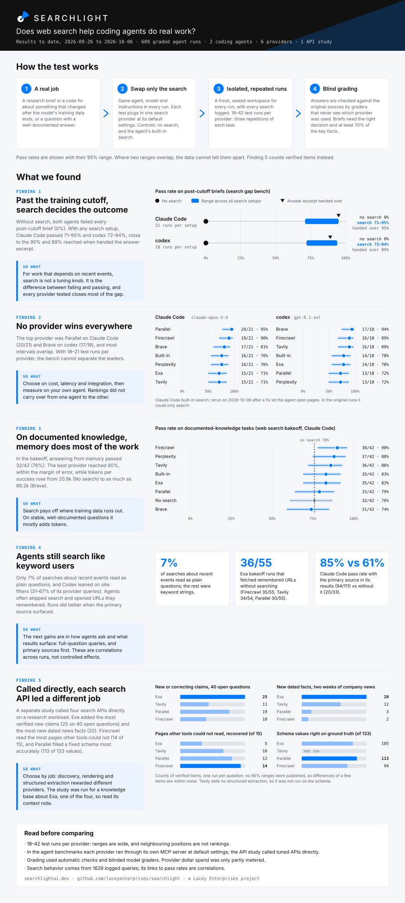
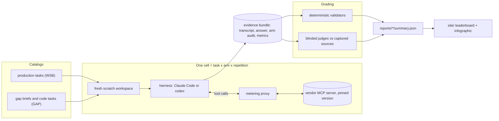
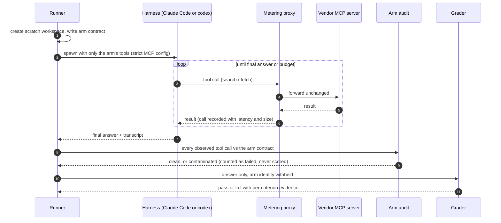
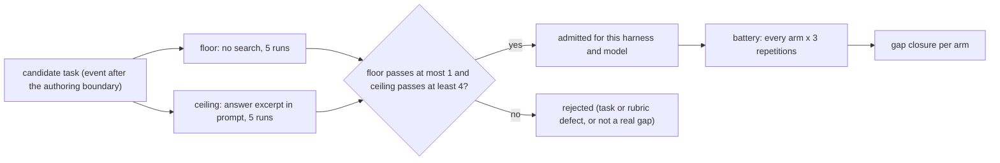
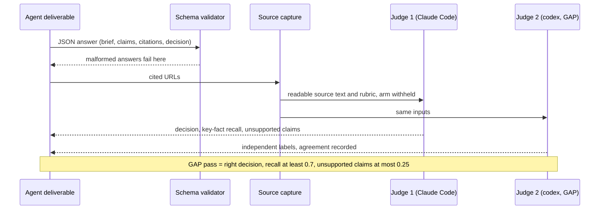
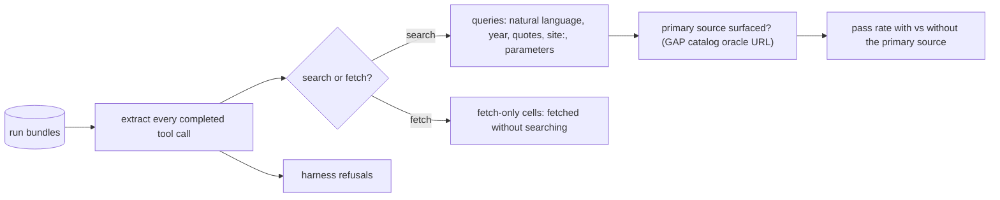
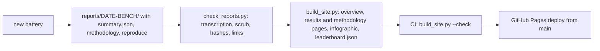
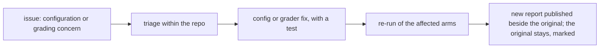

# Searchlight

**Website: [searchlightai.dev](https://searchlightai.dev)**

**An open benchmark of what web search does for coding agents.** Searchlight runs real
agent harnesses (Claude Code and codex) against task catalogs. Each run gives the agent
exactly one retrieval arm: one vendor's search server, the harness's own built-in search,
or no search at all. Searchlight then grades the finished job, not the search results. It also
records every tool call, so you can see *how* the agent used the tool it was given.



- **Website:** [searchlightai.dev](https://searchlightai.dev): an overview, then
  [results](https://searchlightai.dev/results.html) (leaderboards and full run reports) and
  [methodology](https://searchlightai.dev/methodology.html). Generated into [`site/`](site/) and
  published from `main` on every report change.
- **Machine-readable leaderboard:** [`site/leaderboard.json`](site/leaderboard.json).
- **Recorded reports:** [`reports/`](reports/README.md).

> **Before comparing vendors:**
> - Each arm ran 18 to 42 cells, and the 95% intervals overlap almost everywhere.
> - In the agent benchmarks, every vendor was tested through its own MCP server at a pinned version with default
>   settings. The separate [search API head-to-head](reports/2026-09-26-search-api-head-to-head/REPORT.md) called
>   four vendors' APIs directly with tuned parameters, ran each question once, and was run for a knowledge base about
>   Exa, one of the four.
> - Rankings changed between the two agents.
>
> Read [Fairness and known limitations](#fairness-and-known-limitations) before quoting a position.

---

## What Searchlight measures

| Benchmark | Question it answers | Unit of work | Graded on |
|---|---|---|---|
| **WSB** (web search bakeoff) | Does an arm help an agent answer research questions correctly? | 18 production tasks, 3 repetitions | deterministic validators or a blinded rubric judge |
| **GAP** (search gap bench) | Does search change the outcome of a job whose answer post-dates the model? | calibrated briefs (and code tasks) | the finished deliverable, judged against captured primary sources |
| **DSB** (domain strength bench) | Which retrieval surface is strong in which domain? | recorded domain observations | per-domain scorecards |
| **Behavior analysis** | How did the agent actually use its tool? | every logged tool call | query style, search versus fetch, primary-source retrieval |

```
                       ┌──────────────────────────────────────────────────────────┐
                       │             the same agent, the same prompt              │
                       │      Claude Code (claude-opus-5-5)  or  codex (gpt-6.1)  │
                       └───────────────────────────┬──────────────────────────────┘
                                                   │ exactly one retrieval arm
   ┌──────────┬──────────┬──────────┬──────────┬───┴──────┬──────────┬──────────┬──────────┐
   │no-search │  native  │  Brave   │  Tavily  │   Exa    │ Parallel │Firecrawl │Perplexity│
   │ (memory) │ harness  │   MCP    │   MCP    │   MCP    │   MCP    │   MCP    │   MCP    │
   │          │ built-in │  server  │  server  │  server  │  hosted  │  server  │  server  │
   └──────────┴──────────┴──────────┴──────────┴──────────┴──────────┴──────────┴──────────┘
   GAP adds two reference arms per task:  floor = no search    ceiling = answer excerpt in prompt
```

## How a run works



### Anatomy of one cell



### What each arm can touch

Arms differ only in their retrieval surface. Everything else (model, prompt, budgets,
workspace) is identical.

```
 Claude Code                                         codex
 ───────────                                         ─────
 claude --print --output-format stream-json          codex exec --json --ephemeral
   --mcp-config <cell>/claude-mcp.json                 --sandbox read-only
   --strict-mcp-config        ← only this arm's server --disable shell_tool --disable unified_exec
   --tools <arm built-ins>    ← restricts built-ins    --disable browser_use --disable computer_use
   --allowedTools <same set>  ← pre-approves them      --disable apps --disable plugins ...
                                                       (+ --search on the native arm only)
 ┌──────────────┬──────────────────────────────┐    ┌──────────────┬───────────────────────────┐
 │ provider arm │ ToolSearch, Read             │    │ provider arm │ one MCP server            │
 │              │ + mcp__<vendor>__*           │    │              │                           │
 │ native arm   │ WebSearch, WebFetch, Read    │    │ native arm   │ built-in search and       │
 │              │                              │    │              │ page views                │
 │ no-search,   │ nothing                      │    │ no-search,   │ nothing                   │
 │ floor,       │                              │    │ floor,       │                           │
 │ ceiling      │                              │    │ ceiling      │                           │
 └──────────────┴──────────────────────────────┘    └──────────────┴───────────────────────────┘
 Read is local: Claude Code saves oversized tool results to a file the model must Read.
```

After every cell an **arm audit** compares each observed tool call with the arm contract.
A call outside the contract (for example, a provider arm reaching native search) marks the
cell contaminated. A contaminated cell counts as a failure and is never scored as a pass.

### Code tasks run inside an egress sandbox

GAP code tasks give the agent a real repository, a shell and an offline wheel cache. The
agent must not download the fixed package version, or read it from the verifier's copy.

```
┌──────────────────────────────────────────────────────────────────────────────┐
│ host                                                                         │
│  ┌─────────────────────────────────────────────────────────────────────────┐ │
│  │ egress sandbox: Seatbelt (macOS) or bubblewrap (Linux)                  │ │
│  │   network: deny all  ·  canary probes must be refused before the cell   │ │
│  │  ┌───────────────────────────────────────────────────────────────────┐  │ │
│  │  │ agent workspace: repo + old/dependency wheels only (no fixed one) │  │ │
│  │  │   pip forced offline; package commands audited                    │  │ │
│  │  └───────────────────────────────────────────────────────────────────┘  │ │
│  │   verifier cache (old + new wheels): read-denied to the agent           │ │
│  └─────────────────────────────────────────────────────────────────────────┘ │
│  search arm traffic leaves only through the arm's MCP server                 │
└──────────────────────────────────────────────────────────────────────────────┘
```

Cells whose isolation cannot be established are refused, not run. See
[RUNBOOK-gap.md](RUNBOOK-gap.md) for the full isolation contract.

## GAP: calibration and gap closure

A GAP task counts only if it is out of the model's reach without search, and within reach
when the answer is handed over. Calibration is repeated for each harness and model.



```
gap closure  =  (arm pass rate − floor pass rate) / (ceiling pass rate − floor pass rate)

   floor                         arm                              ceiling
   0%  ●────────────────────────────●──────────────────────────────●  95%
       └─────────── closed ─────────┘└────────── remaining ────────┘
   1.00 = the arm did as well as handing the agent the answer. It can exceed 1.
```

## Grading



- **WSB** uses deterministic validators where a task has one. Otherwise a single blinded
  Claude Code judge scores the task rubric.
- **Statistics:**
  - Pass rates carry Wilson 95% intervals.
  - GAP compares each arm with the floor by an exact McNemar test (paired by task and repetition).
  - GAP gap-closure intervals use a seeded paired task bootstrap.
- **GAP tokens per success** counts every agent token in an arm, failed cells included, divided by
  the number of passing cells. **WSB tokens per success** uses measured tokens from graded cells
  divided by measured successes; ungraded and unmeasured cells are excluded, and per-arm
  coverage counts were not retained.

## Measuring how agents search

`scripts/analyze_search_behavior.py` reads stored transcripts. It makes no network or model calls.



The rules are deliberately simple and are printed in the
[methodology](reports/2026-10-05-agent-search-behavior/methodology.md). Because the
natural-language rule can miss descriptive phrasing, every Exa query was also checked by
hand; Exa is the tool that explicitly asks for page descriptions. All 111 are published in
the report's appendix.

## Fairness and known limitations

Engineers from every tested service will read this, so the limitations come first.

- **Small samples.**
  - Each arm ran 18 to 21 cells per harness on GAP and 42 on the WSB competitive set.
  - Adjacent positions are not rankings.
  - No WSB arm differs from answering without search at 95% confidence.
- **One interface per vendor.** Each vendor ran through its own MCP server at the version
  pinned in [`config/provider-arm-tools.yaml`](config/provider-arm-tools.yaml), with default
  settings. Every tool the server advertised was available. In the agent benchmarks, direct
  APIs, other modes, and vendor features the MCP server does not expose were not tested. For
  example, Exa's advanced search tool was not enabled, and Parallel's hosted server ran without a
  pinned mode. The [search API head-to-head](reports/2026-09-26-search-api-head-to-head/REPORT.md)
  tested the APIs directly, with no agent; its results do not transfer to agents, or back.
- **The agent matters.** Parallel led on Claude Code and tied for last on codex. A provider's
  position on one harness does not transfer to another.
- **Native-arm defect (corrected).**
  - Claude Code's native arm exposed WebFetch but pre-approved only WebSearch.
  - Headless Claude Code refused those WebFetch calls: in every GAP native cell and in 40 of 54
    WSB native cells.
  - Its native rows understate Claude Code's own web tools, and are flagged everywhere they appear.
  - The arm configuration is fixed and pinned by a test.
- **Agents fetch from memory.** On WSB's documented-knowledge tasks, Claude Code often
  fetched remembered URLs without searching. Arms with a fetch tool therefore measured fetching
  as much as search.
- **Cost.**
  - GAP tokens per success counts all agent tokens, failed cells included. WSB excludes
    ungraded and unmeasured cells; its per-arm coverage counts were not retained.
  - Vendor dollar spend was metered only on WSB, and only where a tariff or reported spend existed.
  - GAP batteries ran with vendor metering off.
  - Dollar comparisons are therefore not published in the leaderboard. Pricing coverage per
    vendor is reported separately.
- **Grading.** Judges are models: Claude Code on both benchmarks, plus codex as a second judge
  on GAP. They see sources and rubrics, never the arm.
- **Task mix.**
  - GAP admitted 7 brief tasks for Claude Code and 6 for codex, so cross-harness comparisons
    mix agent and task effects.
  - WSB is mostly stable, documented knowledge, where search adds least.
- **Corrections are published beside the original numbers, never silently replaced.** If you
  maintain a tested service and see something wrong, see [For vendors](#for-vendors-corrections-and-re-runs).

### Provider configurations used

| Arm | Interface | Pinned version | Tools exposed |
|---|---|---|---|
| Brave | stdio MCP server | `@brave/brave-search-mcp-server@2.1.4` | 8 (`brave_web_search`, `brave_llm_context`, news, local, place, image, video, summarizer) |
| Tavily | stdio MCP server | `tavily-mcp@0.2.22` | 5 (search, extract, crawl, map, research) |
| Exa | stdio MCP server | `exa-mcp-server@3.4.1` | 2 (`web_search_exa`, `web_fetch_exa`) at defaults: `auto`, 10 results, highlights |
| Parallel | hosted MCP via `mcp-remote@0.14.3` | `search.parallel.ai/mcp-oauth` | 2 (`web_search`, `web_fetch`), no mode override |
| Firecrawl | stdio MCP server | `firecrawl-mcp@3.26.0` | 29 (search, scrape, crawl, map, extract, agent, research, monitor, …) |
| Perplexity | stdio MCP server | `@perplexity-ai/mcp-server@1.3.0` | 4 (search, ask, research, reason) |
| native | harness built-in | Claude Code 2.1.282 / codex `--search` | WebSearch + WebFetch (Claude Code); built-in search and page views (codex) |

## Quickstart

```sh
pipx install 'git+https://github.com/laceyenterprises/searchlight'
sew doctor          # mode, state root, key presence, harness logins, sandbox qualification
```

`searchlight` and `sew` are the same command.

```
 ┌──────────────── standalone (default) ────────────────┐   ┌─────── agent-os (optional) ──────┐
 │ provider keys:  SEW_<VENDOR>_API_KEY or a local .env │   │ keys via a host secrets service  │
 │ harness auth:   your own `claude` / `codex` login    │   │ harness auth via a token broker  │
 │ state:          ~/.local/share/sew                   │   │ installs with the [agent-os]     │
 │ selected by:    SEW_MODE=standalone or auto          │   │ extra; never required            │
 └──────────────────────────────────────────────────────┘   └──────────────────────────────────┘
```

Provider keys come from environment variables: `SEW_EXA_API_KEY`, `SEW_PARALLEL_WEB_API_KEY`,
`SEW_FIRECRAWL_API_KEY`, `SEW_BRAVE_API_KEY`, `SEW_BRAVE_ANSWERS_API_KEY`, `SEW_TAVILY_API_KEY`
and `SEW_PERPLEXITY_API_KEY`.
- An untracked `.env` also works (`SEW_ENV_FILE` selects it).
- `SEW_*_API_KEY_REF=env:NAME` references another variable.
- Never commit keys.
- Live runs require `SEW_HARNESS_LIVE=1` and spend model and provider quota.

```sh
# offline: recorded fixtures, no keys, no network
sew run --suite lighthouse --mode fixture

# live web search bakeoff (budgeted)
SEW_HARNESS_LIVE=1 sew run --suite wsb-trial --mode live \
  --provider-mcp-config /path/to/provider-mcp.yaml \
  --max-provider-calls 400 --max-provider-result-chars 1000000 \
  --max-total-tokens 3000000 --max-wall-clock-seconds 14400
sew bakeoff report /path/to/suite-run

# GAP: calibrate first, then run the battery, per harness and model
SEW_HARNESS_LIVE=1 sew gap calibrate --harness codex --model MODEL_ID --reps 5 --wheelhouse /path/to/wheels
SEW_HARNESS_LIVE=1 sew gap run --harness codex --model MODEL_ID --arm floor --arm ceiling --arm native \
  --reps 3 --wheelhouse /path/to/wheels --run-root /path/to/gap-battery
sew gap report /path/to/gap-battery

# how did the agents search?
python3 scripts/analyze_search_behavior.py /path/to/suite-run --catalog catalogs/gap/tasks.yaml --json out.json
```

The provider MCP configuration is a YAML file outside the repository, and it names keys by
environment reference. See [configuration and metering](WORKBENCH.md) and
[RUNBOOK-gap.md](RUNBOOK-gap.md) before any live execution.

## Reproducing the published results

Each report directory contains `reproduce.md`, with exact historical and shipped catalog
hashes. Raw transcripts and provider responses are not distributed, so the published
aggregates cannot be replayed exactly. The one exception is the search API head-to-head's
Monitors probe, whose raw responses are published with its report. A new live run measures the same method on today's
models, indexes and sources.

```sh
python3 scripts/check_reports.py        # transcription, scrub, catalog hashes, links
python3 scripts/build_site.py --check   # leaderboard and infographic match the reports
SEW_MODE=standalone python3 -m pytest -q
```

### How the leaderboard stays current

The results page displays search setups, test runs and agents in place of internal
benchmark terms. Source reports, machine-readable fields and link anchors retain
their original names.

The builder accepts integer or decimal percentage intervals with hyphens or en dashes.
Zero-count groups display 0% with their counts; short table rows receive empty cells,
and code blocks missing a closing fence retain their content. Relative links are bounded
at the repository root. The published page pins Mermaid with a SHA-384 integrity hash;
update the hash alongside its CDN URL in `scripts/build_site.py` when changing versions.



## For vendors: corrections and re-runs



Open an issue with the configuration you recommend (server version, tools, settings) or the
grading decision you dispute, and include a cell from the published tables. Corrections
are re-run and published as new, dated reports. Earlier numbers stay visible, with a note
pointing to the correction.

## Repository layout

```
searchlight/
├── bin/                     hq-sew wrapper, wheel-cache preparation
├── catalogs/                task catalogs: production (WSB), gap, domains, fixtures
├── config/                  pinned provider arm tools, price table, MCP meter tariffs
├── lib/python/sew/          runner, arms, harness adapters, meter, grading, reports
│   └── gap/                 calibration, workspace sandbox, verifier, brief grading
├── reports/                 published reports (summary.json is the source of truth)
├── scripts/                 check_reports, build_site, analyze_search_behavior, gates
├── site/                    generated website: overview, results, methodology, infographic, logo
├── tests/                   offline test suite (recorded fixtures)
├── RUNBOOK-gap.md           GAP isolation contract and operations
└── WORKBENCH.md             detailed engineering reference and design log
```

## Provenance, license, security

- Searchlight was extracted from an internal search evaluation workbench; see
  [PROVENANCE.md](PROVENANCE.md).
- Licensed under [Apache-2.0](LICENSE).
- Report vulnerabilities privately as described in [SECURITY.md](SECURITY.md).
- Contribution guide: [CONTRIBUTING.md](CONTRIBUTING.md).
